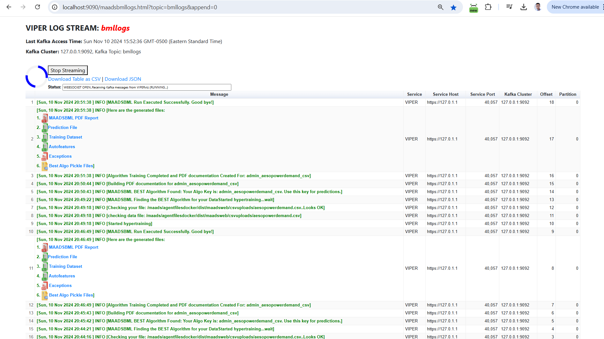

MAADSBML Real-Time Dashboard
=====================

You can see all of the output from the MAADSBML engine in a real-time dashboard.  As shown below.

Dashboard URL
------------
To access the Dashboard simply enter this URL in your browser:

URL: http://localhost:9090/maadsbmllogs.html?topic=bmllogs&append=0

.. note::
   This URL accesses the Kafka topic called: bmllogs.  This the topic you set in the Docker Run command field: VIPERLOGNAME (:ref:`MAADSBML Docker Run Parameters Explained`).

   The port 9090 is set using the value in the field: VIPERVIZPORT

   maadsbmllogs.html is the dashboard HTML running in your MAADSBML container.

   append=0 loads new data into the browser - without appending to the old data.

.. tip::
   As you iterate in your Machine Learning Modeling - MAADSBML stores all the reports in your your backup folder.  

   Therefore, it is important to you map a local folder to the container backup folder (:ref:`MAADSBML Docker Run Parameters Explained`).
