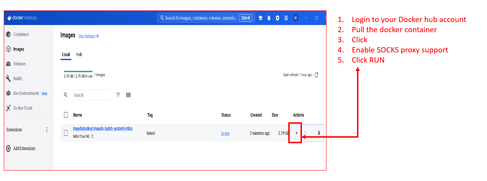

Docker Desktop
===========
If using Docker Desktop CHECK the following options:

Enable host networking

Enable SOCKS proxy support

Click APPLY and RESTART

.. figure:: dockerdesktop.png

If successfull, you will see the ports section filled.   

