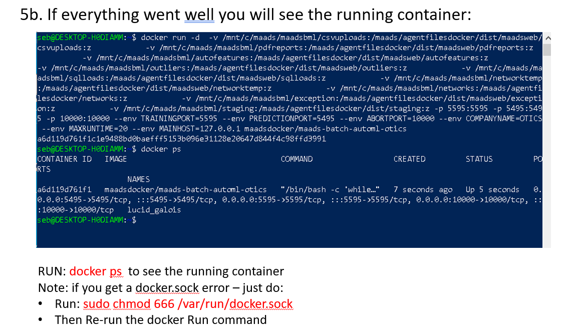
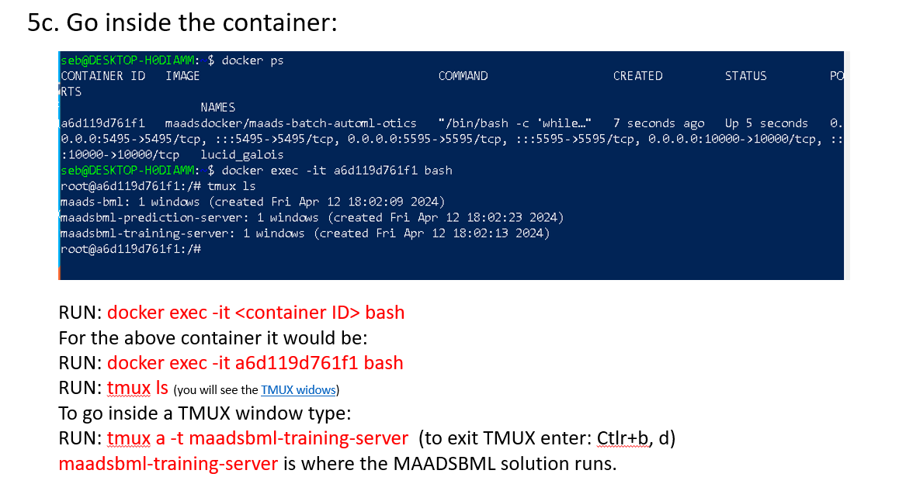

MAADSBML Usage
=====

.. _installation:

Installation
------------

To use MAADSBML, first install docker engine in your computer:

STEP 1: Install Linux
""""""""""

You will need to have Linux OS installed

• In Windows –you can install WSL (windows subsystem for Linux).  Open Powershell or command prompt in Administrator mode and type:

.. code-block:: console
   
   wsl --install

Once wsl is installed then update the Linux distro:

.. code-block:: console
   
   sudo apt update & sudo apt upgrade

• In Mac –Use Terminal

Or get a VM running with Linux Ubuntu installed

STEP 2: Install dOCKER
""""""""""

Install Docker: You can install Docker Desktop (Windows/Mac) Or in linux run: 

.. code-block:: console
   
   sudo apt install docker.io

Give docker socket access to your network:

.. code-block:: console
   
   sudo chmod 666 /var/run/docker.sock

Checking if docker is properly installed do:

.. code-block:: console
   
   docker ps

STEP 3: Pull MAADSBML Docker Container
""""""""""

Pull the maadsbml docker container for Windows/Linux (AMD64):

.. code-block:: console

   docker pull maadsdocker/maads-batch-automl-otics

STEP 3b: Pull MAADSBML Docker Container (MAC/Linux Arm64)
""""""""""

Pull the maadsbml docker container for MAC/Linux (ARM64):

.. code-block:: console

   docker pull maadsdocker/maads-batch-automl-otics-arm64

STEP 4: Install MAADSBML Python Library
""""""""""

Install the MAADSBML Python library:

.. code-block:: console

   pip install maadsbml

.. note:: 

   Furthe Setup and Configurations can be found here: `MAADSBML Setup and Configurations <https://github.com/smaurice101/raspberrypi/tree/main/maadsbml>`_

Running the MAADSBML Docker Container
-------------------------------

Step 1: Create Local Folders
""""""""""""""""""""""""""

.. code-block:: console

   a. {YOUR LOCAL FOLDER PATH}/csvuploads

   b. {YOUR LOCAL FOLDER PATH}/pdfreports

   c. {YOUR LOCAL FOLDER PATH}/autofeatures

   d. {YOUR LOCAL FOLDER PATH}/outliers

   e. {YOUR LOCAL FOLDER PATH}/sqlloads

   f. {YOUR LOCAL FOLDER PATH}/networktemp

   g. {YOUR LOCAL FOLDER PATH}/networks

   h. {YOUR LOCAL FOLDER PATH}/exception

   i. {YOUR LOCAL FOLDER PATH}/staging

{YOUR LOCAL FOLDER PATH} is the root folder path on your local machine: i.e. c:/maadsbml

.. important:: 

   Once you created local folder - then use the Docker -v to map your local folders to the Docker container folders.  If you do not do volume mappings, all data 
   will be stored ONLY in the docker container and NOT ACCESSIBLE outside of the container.  If you STOP the container **ALL YOUR MAADSBML OUTPUT DATA WILL BE 
   LOST**.

MAADSBML Folder Explanation
""""""""""""""""""""""""

.. list-table::
   :widths: 40 60

   * - **MAADSBML Folder**
     - **Description**
   * - csvuploads
     - THIS IS WHERE YOU STORE YOUR OWN FILE FOR MAADSBML TRAINING
   * - pdfreports
     - THIS IS WHERE YOU WILL FIND THE MAADSBML PDF REPORT
   * - autofeatures
     - THIS IS WHERE YOU WILL FIND THE AUTOFEATURES
   * - outliers 
     - THIS IS WHERE YOU WILL FIND OUTLIERS
   * - sqlloads
     - THIS IS A SYSTEM FOLDER
   * - networktemp
     - THIS IS A SYSTEM FOLDER
   * - networks 
     - THIS IS WHERE THE ALGORITHMS ARE STORED
   * - exception 
     - THIS IS THE JSON FILE FOR THE ALGORITHM OUTPUT
   * - staging 
     - THIS IS A SYSTEM FOLDER

MAADSBML Docker Run Command
----------------

You need to configure and run this command to start the MAADSBML contaner solution.

.. code-block:: console
   
   docker run -d \
   -v {YOUR LOCAL FOLDER PATH}/csvuploads:/maads/agentfilesdocker/dist/maadsweb/csvuploads:z \ 
   -v {YOUR LOCAL FOLDER PATH}/pdfreports:/maads/agentfilesdocker/dist/maadsweb/pdfreports:z \
   -v {YOUR LOCAL FOLDER PATH}/autofeatures:/maads/agentfilesdocker/dist/maadsweb/autofeatures:z \
   -v {YOUR LOCAL FOLDER PATH}/outliers:/maads/agentfilesdocker/dist/maadsweb/outliers:z \
   -v {YOUR LOCAL FOLDER PATH}/sqlloads:/maads/agentfilesdocker/dist/maadsweb/sqlloads:z \
   -v {YOUR LOCAL FOLDER PATH}/networktemp:/maads/agentfilesdocker/dist/maadsweb/networktemp:z \
   -v {YOUR LOCAL FOLDER PATH}/networks:/maads/agentfilesdocker/networks:z \
   -v {YOUR LOCAL FOLDER PATH}/exception:/maads/agentfilesdocker/dist/maadsweb/exception:z \
   -v {YOUR LOCAL FOLDER PATH}/staging:/maads/agentfilesdocker/dist/staging:z \
   -p 5595:5595 \  
   -p 5495:5495 \
   -p 10000:10000 \
   --env TRAININGPORT=5595 \
   --env PREDICTIONPORT=5495 \
   --env ABORTPORT=10000 \
   --env COMPANYNAME='Your Company' \
   --env MAXRUNTIME=120 \
   --env ACCEL=0 \
   --env MAINHOST=127.0.0.1 \
   maadsdocker/maads-batch-automl-otics

.. important::

   Do not modify the right-hand side of the colon in the volume mapping.  For example {YOUR LOCAL FOLDER 
   PATH}/csvuploads **:/maads/agentfilesdocker/dist/maadsweb/csvuploads:z**

MAADSBML Docker Run Parameters Explained
""""""""""""""""""""""""""""

.. list-table::
   :widths: 20 40

   * - **Docker Run Parameter**
     - **Description**
   * - \-d
     - runs the container in detached mode
   * - \-v
     - start of docker volume mapping
   * - \-p
     - port forwarding. For example, -p 5595:5595  means 

       to forward your HOST port 5595 to the CONTAINER port 5595.  

       Left-hand side of the colon is the HOST port, and right 

       hand side of the colon is the container port: HOST:CONTAINER
   * - \--env
     - this is docker's environment variable setting
   * - TRAININGPORT
     - this is the port that MAADSBML listens on 

       for training on your dataset
   * - PREDICTIONPORT
     - this is the port that MAADSBML listens on for 

       predictions after you have trained an algorithm 

       on your dataset
   * - ABORTPORT
     - this is the port that MAADSBML listens on for 

       ABORTING the training run.
   * - COMPANYNAME
     - You can specify your company name.  This will appear 

       on the MAADSBML pdf report output.
   * - MAXRUNTIME
     - You can specify the maximum number of minutes 

       to train on your dataset before MAADSBML aborts.
   * - ACCEL
     - This is useful for training on VERY LARGE datasets.  

       Set this to 1 if training on very large 

       datasets (200K+ rows), otherwise leave at 0.
   * - MAINHOST
     - This is the IP Address MAADSBML will listen 
 
       on for connections.
   * - maadsdocker/maads-batch-automl-otics
     - MAADSBML Docker container for Windows/Linux users
   * - maadsdocker/maads-batch-automl-otics-arm64
     - MAADSBML Docker container for MAC/Linux users
 
.. important::

   Port forwarding is needed to access MAADSBML container from Jupyter notebook or any other exteral application.  MAADSBML is REST API compliant.

If Docker Successfully Setup
--------------------------

Go Inside the Container
--------------------------

